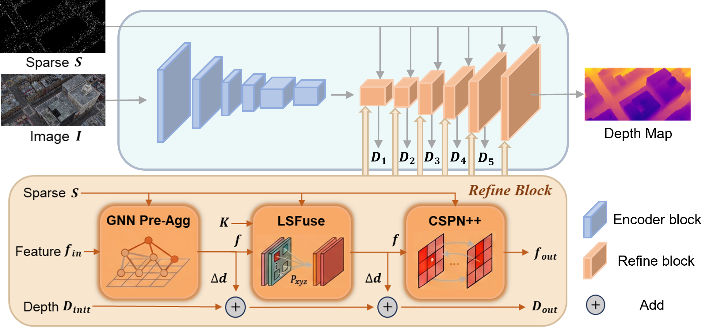

# RefineNet

**[IROS 2026]** Air-Ground Robotic Collaborative Reconstruction by Cross-View Depth Completion In Large-Scale Environment

Official PyTorch implementation of **RefineNet** for sparse depth completion on aerial / air-ground views.

<p align="center">
  
</p>

## Architecture

<p align="center">
  
</p>

Each decoder stage uses a **PMP** block: **Pre** (GNN pre-aggregation) → **MF** (geometry-modulated fusion) → **Post** (CSPN++ propagation).

## Environment

```bash
conda create -n refinenet python=3.10 -y
conda activate refinenet
pip install torch torchvision --index-url https://download.pytorch.org/whl/cu124
pip install timm hydra-core tensorboard opencv-python matplotlib einops triton "numpy<2"
```

## Setup

```bash
cd exts && python setup.py install && cd ..
```

## Dataset

Download datasets into `data/` (default configs already point here):

| Dataset | Path | Link |
|---------|------|------|
| MatrixCity | `data/MatrixCity/big_city_npy/big_city/aerial/` | TBD |
| AGAIRSIM v2 | `data/agairsim_v2/` | TBD |

**MatrixCity** layout: `data/MatrixCity/big_city_npy/big_city/aerial/{train,test}/`

**AGAIRSIM v2** layout: `data/agairsim_v2/SceneName/00/{rgb,depth_z,lidar_project/depth_z}/`  
Train on all scenes except `SimTown_2`; test on `SimTown_2` only.

## Train

**MatrixCity (4 GPUs):**
```bash
torchrun --nproc_per_node=4 --master_port 4321 train.py \
  gpus=[0,1,2,3] num_workers=4 name=REFINE_MATRIXCITY \
  net=RefineUnit data=MATRIXCITY \
  lr=1e-3 train_batch_size=2 test_batch_size=1 \
  sched/lr=NoiseOneCycleCosMo sched.lr.policy.max_momentum=0.90 \
  nepoch=20 ++net.sbn=true
```

**AGAIRSIM v2 (4 GPUs):**
```bash
torchrun --nproc_per_node=4 --master_port 4321 train.py \
  gpus=[0,1,2,3] num_workers=4 name=REFINE_AGAIRSIM \
  net=RefineUnit data=AGAIRSIM \
  lr=1e-3 train_batch_size=2 test_batch_size=1 \
  sched/lr=NoiseOneCycleCosMo sched.lr.policy.max_momentum=0.90 \
  nepoch=20 ++net.sbn=true
```

Checkpoints: `checkpoints/<name>/result_ema.pth`

## Test

**MatrixCity:**
```bash
CUDA_VISIBLE_DEVICES=0 python test.py \
  gpus=[0] name=REFINE_MATRIXCITY ++chpt=REFINE_MATRIXCITY \
  net=RefineUnit data=MATRIXCITY test_batch_size=1 \
  metric=MetricALL ++net.compile=False +save=false +make_video=false
```

**AGAIRSIM v2:**
```bash
CUDA_VISIBLE_DEVICES=0 python test.py \
  gpus=[0] name=REFINE_AGAIRSIM ++chpt=REFINE_AGAIRSIM \
  net=RefineUnit data=AGAIRSIM test_batch_size=1 \
  metric=MetricALL ++net.compile=False +save=false +make_video=false
```

## Results

| Model | RMSE ↓ | MAE ↓ | REL ↓ | D¹ ↑ |
|-------|--------|-------|-------|------|
| **RefineNet** | **0.1319** | **0.0977** | **0.0235** | **0.9971** |
| NLSPN | 0.3115 | 0.2712 | 0.0746 | 0.9835 |
| CSPN | 0.3486 | 0.3070 | 0.0918 | 0.9715 |
| CompletionFormer | 0.3789 | 0.3347 | 0.0951 | 0.9569 |

## Pretrained Models

| Dataset | Checkpoint |
|---------|------------|
| MatrixCity | TBD |
| AGAIRSIM v2 | TBD |

## Acknowledgement

Thanks to [BP-Net](https://github.com/kakaxi314/BP-Net) for the propagation backbone and training framework.

## Citation

```bibtex
@inproceedings{refinenet2026iros,
  title={Air-Ground Robotic Collaborative Reconstruction by Cross-View Depth Completion In Large-Scale Environment},
  booktitle={IEEE/RSJ International Conference on Intelligent Robots and Systems (IROS)},
  year={2026}
}
```

## License

See [LICENSE](LICENSE).
